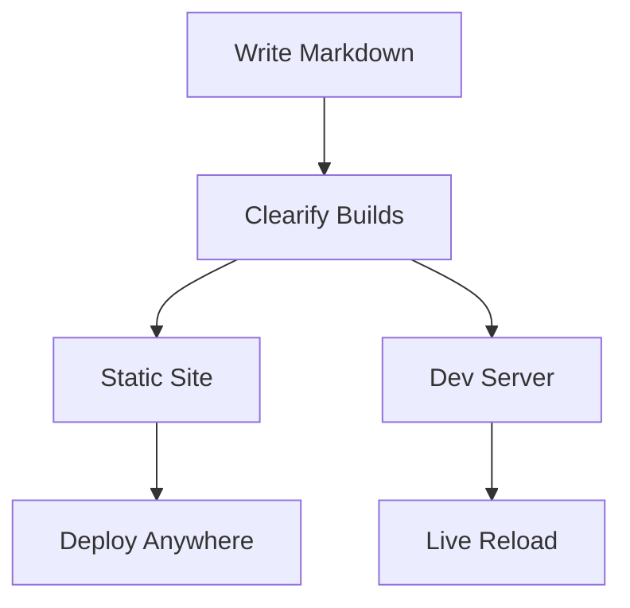
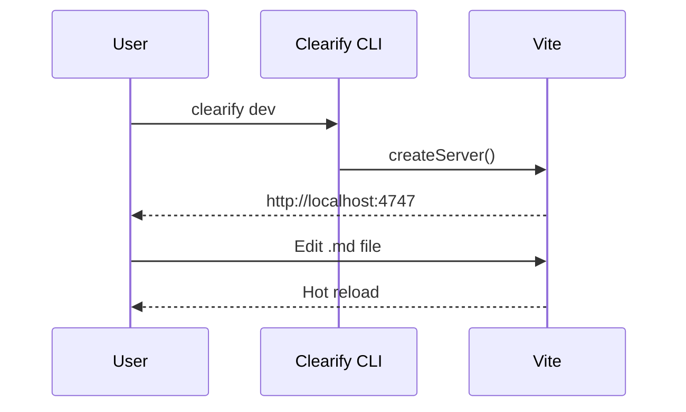

# Components

Clearify ships with a set of built-in MDX components you can use in any `.mdx` file.

## Callout

Use callouts to highlight important information.

<Callout type="info" title="Information">
  This is an informational callout for general notes.
</Callout>

<Callout type="warning" title="Warning">
  This is a warning callout for things to watch out for.
</Callout>

<Callout type="error" title="Error">
  This is an error callout for critical issues.
</Callout>

<Callout type="tip" title="Tip">
  This is a tip callout for helpful suggestions.
</Callout>

## Tabs

Use tabs to show alternative content side by side.

<Tabs>
  <Tab label="pnpm">
    ```bash
    pnpm add @marlinjai/clearify
    ```
  </Tab>
  <Tab label="npm">
    ```bash
    npm install @marlinjai/clearify
    ```
  </Tab>
  <Tab label="yarn">
    ```bash
    yarn add @marlinjai/clearify
    ```
  </Tab>
</Tabs>

## Steps

Use steps for sequential instructions.

<Steps>
  <Step title="Install Clearify">
    Add Clearify to your project as a dev dependency.
  </Step>
  <Step title="Create docs folder">
    Create a `docs/` directory and add your first markdown file.
  </Step>
  <Step title="Start the dev server">
    Run `pnpm exec clearify dev` to see your docs at `http://localhost:4747`.
  </Step>
</Steps>

## Cards

Use cards to link to related pages or highlight features.

<CardGroup cols={2}>
  <Card title="Getting Started" href="/getting-started">
    Learn how to set up Clearify in your project.
  </Card>
  <Card title="Configuration">
    Customize your docs with `clearify.config.ts`.
  </Card>
  <Card title="MDX Support">
    Use React components inside your markdown files.
  </Card>
  <Card title="Dark Mode">
    Automatic light and dark theme switching.
  </Card>
</CardGroup>

## CodeGroup

Use code groups to show the same concept in multiple languages.

<CodeGroup>
```javascript
function greet(name) {
  return `Hello, ${name}!`;
}
```

```typescript
function greet(name: string): string {
  return `Hello, ${name}!`;
}
```

```python
def greet(name: str) -> str:
    return f"Hello, {name}!"
```
</CodeGroup>

## Mermaid Diagrams

Use fenced code blocks with the `mermaid` language to render diagrams.





## StatusBadge

Display a color-coded project status pill.

<StatusBadge status="active" /> <StatusBadge status="beta" /> <StatusBadge status="planned" /> <StatusBadge status="deprecated" />

## ProjectCard

A card component for displaying project information with an optional status badge, tags, and links.

<ProjectCard
  name="Storage Brain"
  description="File storage & processing service with OCR and thumbnail generation."
  status="active"
  icon="🧠"
  tags={["cloudflare", "r2"]}
  repo="https://github.com/example/storage-brain"
  href="/getting-started"
/>

## ProjectGrid

A responsive grid layout for project cards. Renders 3 columns by default, collapsing to 2 and then 1 on smaller screens.

<ProjectGrid cols={2}>
  <ProjectCard
    name="Storage Brain"
    description="File storage & processing service."
    status="active"
    icon="🧠"
    tags={["cloudflare"]}
  />
  <ProjectCard
    name="Data Table"
    description="Notion-like database component."
    status="beta"
    icon="📊"
    tags={["react"]}
  />
</ProjectGrid>
