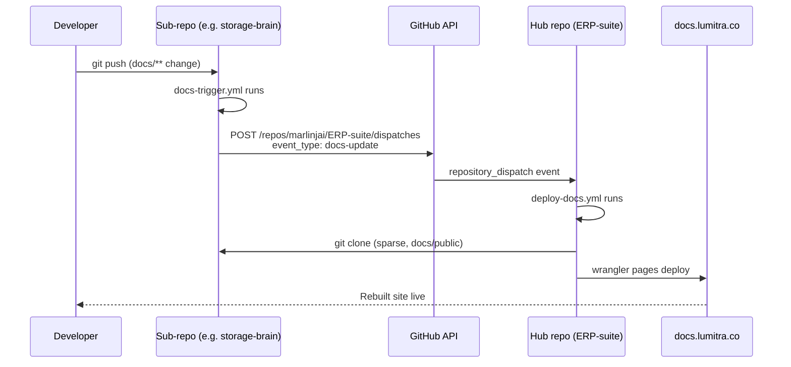

# Hub Model

## What a hub is

A hub is one Clearify site that aggregates documentation from many repositories. Instead of every project running its own standalone docs deployment, each project owns a `docs/public/` folder and registers itself with the hub. The hub clones only the docs from each registered repo, assembles them into a single site, and deploys once.

The model exists to fight drift. When every project ships its own docs site, you end up with N Cloudflare Pages projects, N deploy workflows, N domains, and N chances for something to be stale. Versioning across sites diverges. Cross-project links rot. Global search never works. The hub flips that: one deployment, one domain (e.g. `docs.lumitra.co`), one search index, one sidebar that sees every project. Each sub-repo still owns its markdown. The hub just pulls and renders.

Contrast with the "every project runs its own docs" pattern: there you maintain N pipelines, pay for N static hosts, and users have to know which project lives where. With the hub model, users open one site and find everything. Developers push docs to their own repo, a dispatch fires, the hub rebuilds. That's it.

## The three project modes

Every entry in the hub's `hub.projects` array has a `mode` that controls how it integrates. The modes are defined in `HubProject` in `src/types/index.ts`.

### `link`

A card on the hub's project grid that links out to an external URL. No clone, no docs imported. Use `link` when the project has its own documentation site you don't want to replace (external open-source tools, third-party services, anything living on a domain you don't control).

```typescript
{
  name: 'Acme API',
  description: 'Third-party API we integrate with',
  mode: 'link',
  href: 'https://api.acme.com/docs',
  status: 'active',
}
```

`link` is the default when `mode` is omitted and `href` is set.

### `embed`

Clones the sub-repo via sparse checkout, reads its `clearify.config.ts`, and imports each of its sections as a new tab in the hub. This is the default mode for first-party projects that should be part of the hub. Every `embed` entry needs `git: { repo, ref, path }`.

```typescript
{
  name: 'Storage Brain',
  description: 'File storage and processing service',
  mode: 'embed',
  git: {
    repo: 'https://github.com/marlinjai/storage-brain.git',
    ref: 'main',
    path: 'docs/public',
  },
  embedSections: 'public',
  status: 'active',
}
```

Use `embed` when the sub-project has its own section structure (e.g. "API Reference", "Guides", "Internal") and you want those structures preserved as separate tabs in the hub.

### `inject`

Clones the sub-repo, then overlays its docs into an existing hub section via symlinks. No new tab is created: the sub-repo's pages show up inside a folder of the hub's own navigation tree. Use `inject` when you want many small projects aggregated under a single "Projects" or "Architecture" section rather than each getting its own tab.

```typescript
{
  name: 'Brain Core',
  description: 'Shared infrastructure for Brain services',
  mode: 'inject',
  git: { repo: 'https://github.com/marlinjai/brain-core.git' },
  injectInto: 'architecture',
  docsPath: 'docs',
  group: 'Services',
}
```

`injectInto` is the slug of the target section (derived from the section's `label`). `docsPath` is the folder inside the cloned repo to pull from. `group` is an optional subdirectory name to nest the project under.

### Choosing a mode

| Situation | Mode |
|-----------|------|
| Project has its own docs site elsewhere, link to it | `link` |
| First-party project, its own sections, full structure preserved | `embed` |
| Many small projects, aggregated into one section | `inject` |

## Sparse checkout

Hubs only ever need `docs/public/` from each repo. Cloning the full tree is wasteful: a 500MB monorepo with a 2MB docs folder should not pull 500MB every build. Clearify clones only the specified `path` via `git sparse-checkout` whenever `RemoteGitSource.path` is set. This is the default for `embed` entries scaffolded by `clearify init --hub`.

The expected shape in config:

```typescript
git: {
  repo: 'https://github.com/marlinjai/storage-brain.git',
  ref: 'main',           // branch, tag, or SHA
  path: 'docs/public',   // triggers sparse checkout
  sparse: true,          // optional, defaults to true when path is set
}
```

The clone command Clearify runs is equivalent to:

```bash
git clone --no-checkout --depth 1 --branch main <repo> <cache>
git -C <cache> sparse-checkout init --cone
git -C <cache> sparse-checkout set docs/public
git -C <cache> checkout
```

Result: one directory per repo in the cache, containing only `docs/public/`. Fast clone, small disk footprint, no ambiguity about which subtree is the docs source.

Clones live in `node_modules/.cache/clearify-remote/<slug>/` by default. Override with `hub.cacheDir` in config.

## The dispatch rebuild pipeline

This is the mechanism that keeps the hub in sync. A sub-repo pushes a doc change, the hub rebuilds within minutes, the new content is live. No polling, no webhook service, just GitHub's built-in `repository_dispatch` event.

### End-to-end flow



### The three pieces

**1. Sub-repo workflow: `docs-trigger.yml`**

Fires on every push to main that touches `docs/**` or `clearify.config.ts`. Does no build of its own, just a single curl to GitHub's dispatch endpoint.

```yaml
name: Docs Trigger

on:
  push:
    branches: [main]
    paths:
      - 'docs/**'
      - 'clearify.config.ts'

jobs:
  notify-hub:
    runs-on: ubuntu-latest
    steps:
      - name: Trigger hub rebuild
        run: |
          curl -X POST \
            -H "Authorization: token ${{ secrets.HUB_DISPATCH_TOKEN }}" \
            -H "Accept: application/vnd.github.v3+json" \
            https://api.github.com/repos/marlinjai/ERP-suite/dispatches \
            -d '{"event_type": "docs-update"}'
```

`clearify init --hub` generates this file for you. The hub `owner/repo` is baked into the curl URL at scaffold time.

**2. Hub workflow: `deploy-docs.yml`**

Listens for `repository_dispatch` of type `docs-update` (and also runs on direct pushes to the hub repo itself). Clones nothing itself: Clearify handles all the sub-repo clones internally when you run `docs:build`.

```yaml
on:
  push:
    branches: [main]
  repository_dispatch:
    types: [docs-update]

jobs:
  deploy:
    runs-on: ubuntu-latest
    steps:
      - uses: actions/checkout@v4
      - run: pnpm run docs:build
      - run: npx wrangler pages deploy docs-dist --project-name=erp-suite-docs
```

During `docs:build`, Clearify reads `clearify.data.json`, walks `hub.projects`, and for every `embed` or `inject` entry runs the sparse-checkout flow from the section above. Each project's docs get pulled fresh at build time, so what ships is always current.

**3. The secret: `HUB_DISPATCH_TOKEN`**

A GitHub Personal Access Token with `Contents: Write` scope on the hub repo (classic tokens: `repo` scope). Stored as a GitHub Actions secret on every sub-repo. The curl call above reads it from `secrets.HUB_DISPATCH_TOKEN`. Without it, the dispatch call gets 401 and the hub never rebuilds.

Distribution is handled by Terraform (see next section), not by the CLI.

## `clearify init --hub`

One command to register a new project with the hub. Run it in a fresh repo after `clearify init`, or pass `--hub` to `init` directly.

```bash
pnpm exec clearify init --hub
```

### What happens, step by step

1. **Detects the current project.** Reads `package.json` for the name (or falls back to the directory name). Parses the `origin` remote to get `owner/repo`. Errors out if not a GitHub repo.

2. **Prompts for the hub.** Asks for the hub repository as `owner/repo` (e.g. `marlinjai/ERP-suite`). No discovery API (yet): you type it.

3. **Opens GitHub OAuth via device flow.** Requires `CLEARIFY_GITHUB_CLIENT_ID` to be set in your environment (the client ID of a GitHub OAuth App with `repo` scope). The CLI hits `https://github.com/login/device/code`, prints a user code, opens your browser to the verification URL, and polls for the token. See GitHub's docs on [OAuth App device flow](https://docs.github.com/en/apps/oauth-apps/building-oauth-apps/authorizing-oauth-apps#device-flow) for how this works.

4. **Writes the registry.** Reads `clearify.data.json` from the hub repo via the GitHub Contents API (`GET /repos/{owner}/{repo}/contents/clearify.data.json`), appends a new `HubProject` entry (mode `embed`, `git: { repo, ref: main, path: docs/public }`), and commits it back via `PUT`. If the project name already exists, it updates the entry in place.

5. **Generates local files.** Creates `clearify.config.ts` with a `hubProject` block (description, status), plus `.github/workflows/docs-trigger.yml` wired to the hub repo you selected. Skips either file if it already exists.

6. **Prints next steps.** Points you at the Terraform deployment that distributes `HUB_DISPATCH_TOKEN`.

### What it does NOT do (yet)

The v1.14.0 implementation writes the registry and the local files. It does not create the `HUB_DISPATCH_TOKEN` secret on the new repo. Secret distribution is delegated to Terraform. See the next section.

The earlier plan (see `hub-evolution.md`) aspired to zero manual steps including secret creation via the GitHub Secrets API, but the simpler implementation that shipped delegates that bit to infrastructure-as-code, which was already managing the token across all other sub-repos.

### Required env var

```bash
export CLEARIFY_GITHUB_CLIENT_ID=Iv1.abc123def456
pnpm exec clearify init --hub
```

If `CLEARIFY_GITHUB_CLIENT_ID` is unset, the command exits with an error. The client ID corresponds to a GitHub OAuth App you (the hub owner) create once and reuse across every `init --hub` invocation.

## `HUB_DISPATCH_TOKEN` via Terraform

Be direct about the current reality: the CLI does not push the token to the sub-repo. That step is managed in the infra repo at `/deployments/hub-dispatch/` and is currently a manual `terraform apply` after `clearify init --hub`.

### The Terraform deployment

`github.tf` declares one `github_actions_secret` resource per sub-repo, all sharing the same `var.hub_dispatch_token` value (sourced from Infisical).

```hcl
locals {
  hub_repos = toset([
    "analytics-platform",
    "brain-core",
    "clearify",
    "email-editor",
    "framer-clone",
    "infra",
    "marlinjai-data-table",
    "receipt-ocr-app",
    "storage-brain",
  ])
}

resource "github_actions_secret" "hub_dispatch_token" {
  for_each        = local.hub_repos
  repository      = each.value
  secret_name     = "HUB_DISPATCH_TOKEN"
  plaintext_value = var.hub_dispatch_token
}
```

One token in Infisical, one apply, all repos get the secret.

### Onboarding a new project, the manual last mile

1. Run `clearify init --hub` in the new project. Registry entry written, workflow generated, code pushed.
2. Open `infra/deployments/hub-dispatch/github.tf`.
3. Add the new repo's name to `local.hub_repos`.
4. From that directory, run:
   ```bash
   cd infra/deployments/hub-dispatch
   ../../scripts/tfrun.sh apply
   ```
5. Terraform creates `HUB_DISPATCH_TOKEN` on the new repo. The dispatch workflow can now fire.

Commit the Terraform change in the same PR as your project registration. The new repo does not need to be touched again.

### Why Terraform and not the CLI

The token is a long-lived secret (PAT with write access to a critical repo). Rotating it in 10 places is painful. With Terraform, you rotate in Infisical, re-apply once, and every sub-repo gets the new value atomically. The CLI could PUT secrets via the GitHub API, but then you'd have two code paths for managing the same thing, and secret rotation would stop being a one-command operation. Delegating to the infrastructure layer is the right tradeoff at this scale.

## Troubleshooting

### "My docs don't appear on the hub"

Walk the pipeline from the bottom up:

1. **Did the sub-repo dispatch fire?** Open the sub-repo's Actions tab. The `Docs Trigger` workflow should have a green run for the commit that changed docs. If it's missing, check that your changes actually match the path filter (`docs/**` or `clearify.config.ts`). If it's red, the most common cause is `HUB_DISPATCH_TOKEN` missing or expired.

2. **Did the hub receive it?** Open the hub repo's Actions tab. Look for a `Deploy Docs` run triggered by `repository_dispatch` right after your sub-repo's dispatch. If nothing shows up, the token is probably invalid (the dispatch API returned 401 silently as far as the sub-repo's curl is concerned, but the run shows green unless you add `--fail-with-body` to the curl).

3. **Did the hub build succeed?** If the `Deploy Docs` run failed, check the step logs. Clone failures for a specific embed are caught in `scanHubProjects` and logged as warnings, so the build won't abort: instead, that project's docs silently go missing from the output.

4. **Check secret existence.** Go to the sub-repo's Settings: Secrets and variables: Actions. `HUB_DISPATCH_TOKEN` should be listed. If not, you forgot step 3 in the onboarding checklist (add the repo to `local.hub_repos` and apply).

### "Hub build fails silently for one embed"

When `scanHubProjects` hits an error cloning an embed entry, it logs a warning and continues. Look for lines like:

```
⚠ Hub embed "storage-brain" failed: Failed to clone remote repo ...
```

Common causes:

- **Ref doesn't exist.** Test with `git ls-remote <repo> <ref>` locally. If that returns empty, the branch, tag, or SHA in the registry is stale.
- **Private repo, no auth.** The build environment needs credentials. For public repos, this doesn't apply. For private ones, the hub workflow needs a deploy key or GitHub App token.
- **Path doesn't exist in the repo.** Sparse checkout silently produces an empty directory if `path` points nowhere. Check that the sub-repo actually has `docs/public/` (or whatever path is set).

### "Stale docs after push"

Hub clones are cached in `node_modules/.cache/clearify-remote/<slug>/`. For floating refs like `main`, Clearify does a `git fetch origin <ref> --depth 1` on every build, so staleness should not happen in CI (CI starts from a fresh checkout anyway). Locally, if you're running `clearify dev` against hub config and something seems cached, blow the directory away:

```bash
rm -rf node_modules/.cache/clearify-remote
```

Pinned refs (40-char SHA or semver tag) skip the fetch step entirely and are treated as immutable. Change the `ref` field in the registry to invalidate.

### "The dispatch curl returned 401"

`HUB_DISPATCH_TOKEN` is missing, expired, or lacks `Contents: Write` on the hub repo. Fix by rotating in Infisical and running `../../scripts/tfrun.sh apply` in the hub-dispatch deployment.

## Related

- [Configuration](./configuration.md) for the full `hub` config reference (manual project list, `hub.scan`, `HubProject` fields).
- [Getting Started](./getting-started.md) for `clearify init` basics without the hub flow.
