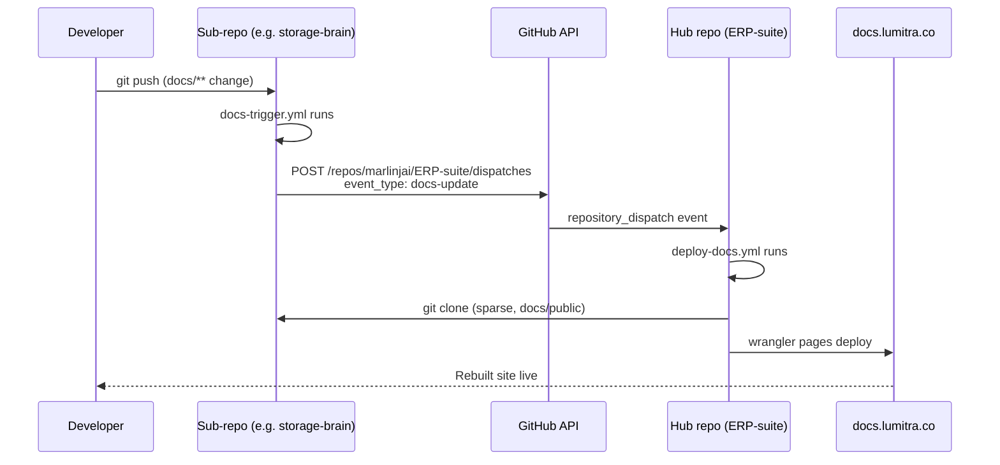

# Hub Model

## What a hub is

A hub is one Clearify site that aggregates documentation from many repositories. Instead of every project running its own standalone docs deployment, each project owns a `docs/public/` folder and registers itself with the hub. The hub clones only the docs from each registered repo, assembles them into a single site, and deploys once.

The model exists to fight drift. When every project ships its own docs site, you end up with N Cloudflare Pages projects, N deploy workflows, N domains, and N chances for something to be stale. Versioning across sites diverges. Cross-project links rot. Global search never works. The hub flips that: one deployment, one domain (e.g. `docs.lumitra.co`), one search index, one sidebar that sees every project. Each sub-repo still owns its markdown. The hub just pulls and renders.

Contrast with the "every project runs its own docs" pattern: there you maintain N pipelines, pay for N static hosts, and users have to know which project lives where. With the hub model, users open one site and find everything. Developers push docs to their own repo, a dispatch fires, the hub rebuilds. That's it.

## The three project modes

Every entry in the hub's `hub.projects` array has a `mode` that controls how it integrates. The modes are defined in `HubProject` in `src/types/index.ts`.

### `link`

A card on the hub's project grid that links out to an external URL. No clone, no docs imported. Use `link` when the project has its own documentation site you don't want to replace (external open-source tools, third-party services, anything living on a domain you don't control).

```typescript
{
  name: 'Acme API',
  description: 'Third-party API we integrate with',
  mode: 'link',
  href: 'https://api.acme.com/docs',
  status: 'active',
}
```

`link` is the default when `mode` is omitted and `href` is set.

### `embed`

Clones the sub-repo via sparse checkout, reads its `clearify.config.ts`, and imports each of its sections as a new tab in the hub. This is the default mode for first-party projects that should be part of the hub. Every `embed` entry needs `git: { repo, ref, path }`.

```typescript
{
  name: 'Storage Brain',
  description: 'File storage and processing service',
  mode: 'embed',
  git: {
    repo: 'https://github.com/marlinjai/storage-brain.git',
    ref: 'main',
    path: 'docs/public',
  },
  embedSections: 'public',
  status: 'active',
}
```

Use `embed` when the sub-project has its own section structure (e.g. "API Reference", "Guides", "Internal") and you want those structures preserved as separate tabs in the hub.

### `inject`

Clones the sub-repo, then overlays its docs into an existing hub section via symlinks. No new tab is created: the sub-repo's pages show up inside a folder of the hub's own navigation tree. Use `inject` when you want many small projects aggregated under a single "Projects" or "Architecture" section rather than each getting its own tab.

```typescript
{
  name: 'Brain Core',
  description: 'Shared infrastructure for Brain services',
  mode: 'inject',
  git: { repo: 'https://github.com/marlinjai/brain-core.git' },
  injectInto: 'architecture',
  docsPath: 'docs',
  group: 'Services',
}
```

`injectInto` is the slug of the target section (derived from the section's `label`). `docsPath` is the folder inside the cloned repo to pull from. `group` is an optional subdirectory name to nest the project under.

### Choosing a mode

| Situation | Mode |
|-----------|------|
| Project has its own docs site elsewhere, link to it | `link` |
| First-party project, its own sections, full structure preserved | `embed` |
| Many small projects, aggregated into one section | `inject` |

## Sparse checkout

Hubs only ever need `docs/public/` from each repo. Cloning the full tree is wasteful: a 500MB monorepo with a 2MB docs folder should not pull 500MB every build. Clearify clones only the specified `path` via `git sparse-checkout` whenever `RemoteGitSource.path` is set. This is the default for `embed` entries scaffolded by `clearify init --hub`.

The expected shape in config:

```typescript
git: {
  repo: 'https://github.com/marlinjai/storage-brain.git',
  ref: 'main',           // branch, tag, or SHA
  path: 'docs/public',   // triggers sparse checkout
  sparse: true,          // optional, defaults to true when path is set
}
```

The clone command Clearify runs is equivalent to:

```bash
git clone --no-checkout --depth 1 --branch main <repo> <cache>
git -C <cache> sparse-checkout init --cone
git -C <cache> sparse-checkout set docs/public
git -C <cache> checkout
```

Result: one directory per repo in the cache, containing only `docs/public/`. Fast clone, small disk footprint, no ambiguity about which subtree is the docs source.

Clones live in `node_modules/.cache/clearify-remote/<slug>/` by default. Override with `hub.cacheDir` in config.

## The dispatch rebuild pipeline

This is the mechanism that keeps the hub in sync. A sub-repo pushes a doc change, the hub rebuilds within minutes, the new content is live. No polling, no webhook service, just GitHub's built-in `repository_dispatch` event.

### End-to-end flow



### The three pieces

**1. Sub-repo workflow: `docs-trigger.yml`**

Fires on every push to main that touches `docs/**` or `clearify.config.ts`. Does no build of its own, just a single curl to GitHub's dispatch endpoint.

```yaml
name: Docs Trigger

on:
  push:
    branches: [main]
    paths:
      - 'docs/**'
      - 'clearify.config.ts'

jobs:
  notify-hub:
    runs-on: ubuntu-latest
    steps:
      - name: Trigger hub rebuild
        run: |
          curl -X POST \
            -H "Authorization: token ${{ secrets.HUB_DISPATCH_TOKEN }}" \
            -H "Accept: application/vnd.github.v3+json" \
            https://api.github.com/repos/marlinjai/ERP-suite/dispatches \
            -d '{"event_type": "docs-update"}'
```

`clearify init --hub` generates this file for you. The hub `owner/repo` is baked into the curl URL at scaffold time.

**2. Hub workflow: `deploy-docs.yml`**

Listens for `repository_dispatch` of type `docs-update` (and also runs on direct pushes to the hub repo itself). Clones nothing itself: Clearify handles all the sub-repo clones internally when you run `docs:build`.

```yaml
on:
  push:
    branches: [main]
  repository_dispatch:
    types: [docs-update]

jobs:
  deploy:
    runs-on: ubuntu-latest
    steps:
      - uses: actions/checkout@v4
      - run: pnpm run docs:build
      - run: npx wrangler pages deploy docs-dist --project-name=erp-suite-docs
```

During `docs:build`, Clearify reads `clearify.data.json`, walks `hub.projects`, and for every `embed` or `inject` entry runs the sparse-checkout flow from the section above. Each project's docs get pulled fresh at build time, so what ships is always current.

**3. The secret: `HUB_DISPATCH_TOKEN`**

A GitHub Personal Access Token with `Contents: Write` scope on the hub repo (classic tokens: `repo` scope). Stored as a GitHub Actions secret on every sub-repo. The curl call above reads it from `secrets.HUB_DISPATCH_TOKEN`. Without it, the dispatch call gets 401 and the hub never rebuilds.

There are three paths to get this secret onto every sub-repo. See below.

## Provisioning HUB_DISPATCH_TOKEN

This secret is the one thing that has to be on every sub-repo for hub mode to work. There are three paths to get it there. They trade automation for setup cost. Pick the one that matches where you are.

### Decision tree

```
Starting a new hub, one or two sub-repos?
  -> Path 1: Manual. Click through GitHub UI. Move on.

Onboarding a handful of sub-repos, comfortable with a CLI?
  -> Path 2: CLI-assisted. Run clearify init --hub --auto-secret.

Operating a hub with 5+ sub-repos, care about rotation?
  -> Path 3: Terraform. Declare the repos, apply once, rotate in one place.
```

You can mix paths. Start with Manual on repo 1, graduate to Terraform when you have 5. The secret itself is identical: a PAT with `Contents: Write` on the hub repo. What differs is who writes it onto each sub-repo.

### Path 1: Manual (GitHub UI)

Lowest-ceremony path. For one-off onboarding.

1. Create a fine-grained PAT at https://github.com/settings/personal-access-tokens/new. Scope: `Contents: Read and write` on the hub repo only. Expiration: 90 days.
2. Copy the token to your secret manager (you reuse it for every sub-repo and for rotation).
3. In the sub-repo, Settings: Secrets and variables: Actions: New repository secret. Name `HUB_DISPATCH_TOKEN`, value the PAT.
4. Push a doc change. Confirm `Docs Trigger` runs green.

Stop using this path when you have added the same PAT to 3+ repos by hand. Switch to Path 3.

### Path 2: CLI-assisted (`clearify init --hub --auto-secret`)

Status: planned. The CLI currently scaffolds config and workflow files but does not write the Actions secret. The `--auto-secret` flag will restore secret provisioning via the GitHub Secrets API after OAuth device flow.

Prerequisites (see [Installation](./installation.md#prerequisites-for-hub-mode)): a GitHub OAuth App with `repo` scope, `CLEARIFY_GITHUB_CLIENT_ID` exported.

```bash
export CLEARIFY_GITHUB_CLIENT_ID=Iv1.abc123
pnpm exec clearify init --hub --auto-secret
```

The CLI prompts for the hub repo, opens a browser for device flow, then appends a `HubProject` entry to the hub's `clearify.data.json`, writes local `clearify.config.ts` and `.github/workflows/docs-trigger.yml`, and `PUT`s `HUB_DISPATCH_TOKEN` on the sub-repo via the Secrets API.

Without `--auto-secret`, `clearify init --hub` does everything except the secret. Finish with Path 1 or Path 3.

Stop using this path when you operate a hub with 5+ sub-repos and need atomic rotation. Switch to Path 3.

### Path 3: Terraform (`github_actions_secret`)

Recommended for 5+ sub-repos or any operator who cares about rotation correctness. One Terraform deployment declares every sub-repo, one `terraform apply` writes the same secret value to all of them.

Example at `infra/deployments/hub-dispatch/github.tf`:

```hcl
locals {
  hub_repos = toset(["analytics-platform", "brain-core", "clearify", "storage-brain"])
}

resource "github_actions_secret" "hub_dispatch_token" {
  for_each        = local.hub_repos
  repository      = each.value
  secret_name     = "HUB_DISPATCH_TOKEN"
  plaintext_value = var.hub_dispatch_token
}
```

`var.hub_dispatch_token` comes from your secret manager (Infisical, Vault, etc).

Onboarding a new sub-repo:

1. Run `clearify init --hub` (no `--auto-secret`) in the new project. Config and workflow written.
2. Add the new repo name to `local.hub_repos` in the Terraform file.
3. Apply:
   ```bash
   cd infra/deployments/hub-dispatch
   terraform apply
   ```
4. The new repo now has `HUB_DISPATCH_TOKEN`. Dispatch will fire on the next doc push.

Commit the Terraform change in the same PR as the sub-repo's config, so the pipeline turns on and the infra is in sync in one reviewable unit.

## Rotation

The PAT in `HUB_DISPATCH_TOKEN` is long-lived write access to the hub repo. Treat it like any production secret: rotate every 90 days, and immediately if a sub-repo is archived, transferred, or forked to an untrusted party.

### General flow

1. Create a new PAT with the same permissions (`Contents: Write` on the hub repo).
2. Update it everywhere (see per-path instructions).
3. Verify: push a doc change on one sub-repo, confirm the hub's `Deploy Docs` run fires.
4. Revoke the old PAT at https://github.com/settings/personal-access-tokens.

### Per-path rotation

- **Path 1 (Manual):** update the secret on each sub-repo by hand. Painful above 2 repos. Migrate to Path 3 before your first rotation.
- **Path 2 (CLI-assisted):** run `clearify hub rotate` (planned) against each sub-repo. Writes a new value via the Secrets API. Faster than Path 1, still per-repo.
- **Path 3 (Terraform):** update the PAT value in your secret manager, run `terraform apply` in `infra/deployments/hub-dispatch`. Every sub-repo in `local.hub_repos` gets the new value atomically.

This is the core reason Path 3 exists. A 10-repo hub goes from a 20-minute manual rotation to a 30-second apply.

## Troubleshooting

### Which provisioning path am I on?

Before debugging the dispatch, identify how the secret got onto the sub-repo. Different paths fail differently.

- Check `infra/deployments/hub-dispatch/github.tf` (or wherever your Terraform lives). If the sub-repo is in `local.hub_repos`, you are on Path 3. Debug by running `terraform plan` and checking for drift.
- Check your shell history (or ask the person who onboarded the repo) for `clearify init --hub --auto-secret`. If it was used, you are on Path 2.
- Otherwise, you are on Path 1. The secret was clicked in by hand. Go to Settings: Secrets and variables: Actions on the sub-repo and confirm `HUB_DISPATCH_TOKEN` is listed.

Common mode of failure per path:
- Path 1: the operator forgot to add the secret after running `clearify init --hub`. Symptom: workflow runs, curl returns 401 silently (unless you have `--fail-with-body`).
- Path 2: OAuth token expired or the OAuth App lost `repo` scope. Symptom: re-running `clearify init --hub --auto-secret` errors on the secret-write step.
- Path 3: the repo name is missing from `local.hub_repos` or the apply was never run. Symptom: secret is simply absent.

### "My docs don't appear on the hub"

Walk the pipeline from the bottom up:

1. **Did the sub-repo dispatch fire?** Open the sub-repo's Actions tab. The `Docs Trigger` workflow should have a green run for the commit that changed docs. If it's missing, check that your changes actually match the path filter (`docs/**` or `clearify.config.ts`). If it's red, the most common cause is `HUB_DISPATCH_TOKEN` missing or expired.

2. **Did the hub receive it?** Open the hub repo's Actions tab. Look for a `Deploy Docs` run triggered by `repository_dispatch` right after your sub-repo's dispatch. If nothing shows up, the token is probably invalid (the dispatch API returned 401 silently as far as the sub-repo's curl is concerned, but the run shows green unless you add `--fail-with-body` to the curl).

3. **Did the hub build succeed?** If the `Deploy Docs` run failed, check the step logs. Clone failures for a specific embed are caught in `scanHubProjects` and logged as warnings, so the build won't abort: instead, that project's docs silently go missing from the output.

4. **Check secret existence.** Go to the sub-repo's Settings: Secrets and variables: Actions. `HUB_DISPATCH_TOKEN` should be listed. If not, you forgot step 3 in the onboarding checklist (add the repo to `local.hub_repos` and apply).

### "Hub build fails silently for one embed"

When `scanHubProjects` hits an error cloning an embed entry, it logs a warning and continues. Look for lines like:

```
⚠ Hub embed "storage-brain" failed: Failed to clone remote repo ...
```

Common causes:

- **Ref doesn't exist.** Test with `git ls-remote <repo> <ref>` locally. If that returns empty, the branch, tag, or SHA in the registry is stale.
- **Private repo, no auth.** The build environment needs credentials. For public repos, this doesn't apply. For private ones, the hub workflow needs a deploy key or GitHub App token.
- **Path doesn't exist in the repo.** Sparse checkout silently produces an empty directory if `path` points nowhere. Check that the sub-repo actually has `docs/public/` (or whatever path is set).

### "Stale docs after push"

Hub clones are cached in `node_modules/.cache/clearify-remote/<slug>/`. For floating refs like `main`, Clearify does a `git fetch origin <ref> --depth 1` on every build, so staleness should not happen in CI (CI starts from a fresh checkout anyway). Locally, if you're running `clearify dev` against hub config and something seems cached, blow the directory away:

```bash
rm -rf node_modules/.cache/clearify-remote
```

Pinned refs (40-char SHA or semver tag) skip the fetch step entirely and are treated as immutable. Change the `ref` field in the registry to invalidate.

### "The dispatch curl returned 401"

`HUB_DISPATCH_TOKEN` is missing, expired, or lacks `Contents: Write` on the hub repo. Fix by rotating in Infisical and running `../../scripts/tfrun.sh apply` in the hub-dispatch deployment.

## Related

- [Configuration](./configuration.md) for the full `hub` config reference (manual project list, `hub.scan`, `HubProject` fields).
- [Getting Started](./getting-started.md) for `clearify init` basics without the hub flow.
